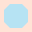

# MetroMania Tile Assets

This folder contains all SVG tile assets used for the top-down, tile-based level designer in MetroMania. Each level is composed of a grid of square tiles. The level editor and renderer use these tiles to paint the map.

Source files (`.afdesign`) are Affinity Designer projects. The `.svg` exports are what the application uses at runtime.

## Tile System Overview

The level grid is made up of **background (grass)** tiles, **water** tiles, and **station** tiles. Water tiles use an **auto-tiling** system: the correct water tile variant is selected based on which of the four cardinal neighbors (North, East, South, West) are also water tiles.

### Compass Directions

The directional suffixes in filenames refer to cardinal neighbors of the tile:

| Direction | Meaning |
|-----------|---------|
| **N** | The tile directly **above** (North) is also a water tile |
| **E** | The tile directly **to the right** (East) is also a water tile |
| **S** | The tile directly **below** (South) is also a water tile |
| **W** | The tile directly **to the left** (West) is also a water tile |

A suffix like `NE` means the neighbors to the North **and** East are both water. A suffix like `WNE` means West, North, and East are all water. The directions always appear in clockwise order: W → N → E → S.

### Corner Tiles: Outer vs Inner

There are two sets of corner tiles (31–34 and 35–38) that share the same directional suffixes. They serve different purposes:

- **Outer corners (31–34):** Used at the **outside bend** of a water body, where the water turns a corner. Only the two indicated perpendicular neighbors are water. The tile shows water along two edges meeting at a corner, with land (grass) filling the opposite corner. Approximately 50% of the tile is water.

- **Inner corners (35–38):** Used at the **inside bend** of a water body, where a large expanse of water has a small diagonal land intrusion. These tiles are mostly water (~75% coverage) with a small triangular land area cutting into one corner. They handle the concave indentations that appear when the water body wraps around a protruding piece of land.

**Example — when to use each:**

```
Outer corner (31-water-NE):       Inner corner (36-water-ES):

    . W .                              W W W
    . W W                              W W W
    . . .                              W W .

The bottom-left tile of the        The bottom-center tile of the
L-shaped water uses an outer       large water body uses an inner
corner because the water turns     corner because the land intrudes
outward at that point.             diagonally into the water.
```

---

## Tile Reference

All tiles are listed below in order of their numeric prefix.

---

### 01 — Background


| File | `01-background.svg` |
|------|---------------------|

The **base grass/land tile**.This is the default tile used for every cell in the grid before any water or stations are placed. It represents flat, open terrain — a plain green/grass surface. Every cell that is not water and does not contain a station renders this tile.

**Usage:** Place this tile at every grid position as the base layer. Water tiles and station tiles are drawn on top of or instead of this tile.

---

### 10 — Water: Full


| File | `10-water-full.svg` |
|------|----------------------|

A **fully surrounded water tile**where **all four** cardinal neighbors (North, East, South, and West) are also water tiles. This tile shows water filling the entire square with no visible land edges or shoreline — it is pure, uninterrupted water.

**Usage:** Use this tile when a water cell is completely surrounded by other water cells on all four sides. This is the interior tile for any large body of water.

**Neighbor conditions:**
- North: Water ✔
- East: Water ✔
- South: Water ✔
- West: Water ✔

---

### 11 — Water: No Neighbours



| File | `11-water-no-neighbours.svg` |
|------|-------------------------------|

An **isolated water tile**where **none** of the four cardinal neighbors are water. This tile shows a small body of water (like a pond or puddle) entirely surrounded by land/shoreline on all four sides.

**Usage:** Use this tile when a single water cell stands alone with no adjacent water cells in any cardinal direction. It renders as a self-contained water feature with shoreline on every edge.

**Neighbor conditions:**
- North: Land ✔
- East: Land ✔
- South: Land ✔
- West: Land ✔

---

### 12 — Water: West–East


| File | `12-water-WE.svg` |
|------|---------------------|

A **horizontal water channel**tile where the **West** and **East** neighbors are water, but the **North** and **South** neighbors are land. The tile shows water flowing left-to-right with shoreline along the top and bottom edges.

**Usage:** Use this tile for horizontal stretches of a river or canal. It connects water to the left and right while presenting land borders above and below.

**Neighbor conditions:**
- North: Land ✔
- East: Water ✔
- South: Land ✔
- West: Water ✔

---

### 13 — Water: North–South


| File | `13-water-NS.svg` |
|------|---------------------|

A **vertical water channel**tile where the **North** and **South** neighbors are water, but the **East** and **West** neighbors are land. The tile shows water flowing top-to-bottom with shoreline along the left and right edges.

**Usage:** Use this tile for vertical stretches of a river or canal. It connects water above and below while presenting land borders to the left and right.

**Neighbor conditions:**
- North: Water ✔
- East: Land ✔
- South: Water ✔
- West: Land ✔

---

### 14 — Water: West–North–East


| File | `14-water-WNE.svg` |
|------|----------------------|

A **T-junction water tile open to the south**where the **West**, **North**, and **East** neighbors are water, but the **South** neighbor is land. The tile shows water covering three sides with a shoreline only along the bottom edge. Think of it as a wide channel with a land bank on the southern side.

**Usage:** Use this tile when water extends in three directions (left, up, and right) but meets land below. This creates a T-shaped or bay-like formation where the southern edge is the shore.

**Neighbor conditions:**
- North: Water ✔
- East: Water ✔
- South: Land ✔
- West: Water ✔

---

### 15 — Water: North–East–South


| File | `15-water-NES.svg` |
|------|----------------------|

A **T-junction water tile open to the west**where the **North**, **East**, and **South** neighbors are water, but the **West** neighbor is land. The tile shows water on three sides with a shoreline only along the left edge.

**Usage:** Use this tile when water extends upward, to the right, and downward, but meets land to the left. This is the left-bank edge of a wide water body or a T-junction where the western edge is shore.

**Neighbor conditions:**
- North: Water ✔
- East: Water ✔
- South: Water ✔
- West: Land ✔

---

### 16 — Water: East–South–West


| File | `16-water-ESW.svg` |
|------|----------------------|

A **T-junction water tile open to the north**where the **East**, **South**, and **West** neighbors are water, but the **North** neighbor is land. The tile shows water on three sides with a shoreline only along the top edge.

**Usage:** Use this tile when water extends to the right, downward, and to the left, but meets land above. This is the top-bank edge of a wide water body or a T-junction where the northern edge is shore.

**Neighbor conditions:**
- North: Land ✔
- East: Water ✔
- South: Water ✔
- West: Water ✔

---

### 17 — Water: South–West–North


| File | `17-water-SWN.svg` |
|------|----------------------|

A **T-junction water tile open to the east**where the **South**, **West**, and **North** neighbors are water, but the **East** neighbor is land. The tile shows water on three sides with a shoreline only along the right edge.

**Usage:** Use this tile when water extends downward, to the left, and upward, but meets land to the right. This is the right-bank edge of a wide water body or a T-junction where the eastern edge is shore.

**Neighbor conditions:**
- North: Water ✔
- East: Land ✔
- South: Water ✔
- West: Water ✔

---

### 18 — Water: North


| File | `18-water-N.svg` |
|------|--------------------|

A **dead-end water tile pointing north**where only the **North** neighbor is water. The tile shows water connecting upward with shoreline on the east, south, and west edges. This is the southern terminus of a water channel — the water ends here and does not continue in any other direction.

**Usage:** Use this tile at the bottom end of a vertical water channel or as the southern tip of a narrow water finger extending downward from a larger body.

**Neighbor conditions:**
- North: Water ✔
- East: Land ✔
- South: Land ✔
- West: Land ✔

---

### 19 — Water: East


| File | `19-water-E.svg` |
|------|--------------------|

A **dead-end water tile pointing east**where only the **East** neighbor is water. The tile shows water connecting to the right with shoreline on the north, south, and west edges. This is the western terminus of a water channel — the water ends here and does not continue left, up, or down.

**Usage:** Use this tile at the left end of a horizontal water channel or as the western tip of a narrow water finger extending leftward from a larger body.

**Neighbor conditions:**
- North: Land ✔
- East: Water ✔
- South: Land ✔
- West: Land ✔

---

### 20 — Water: South


| File | `20-water-S.svg` |
|------|--------------------|

A **dead-end water tile pointing south**where only the **South** neighbor is water. The tile shows water connecting downward with shoreline on the north, east, and west edges. This is the northern terminus of a water channel — the water ends here and does not continue in any other direction.

**Usage:** Use this tile at the top end of a vertical water channel or as the northern tip of a narrow water finger extending upward from a larger body.

**Neighbor conditions:**
- North: Land ✔
- East: Land ✔
- South: Water ✔
- West: Land ✔

---

### 21 — Water: West


| File | `21-water-W.svg` |
|------|--------------------|

A **dead-end water tile pointing west**where only the **West** neighbor is water. The tile shows water connecting to the left with shoreline on the north, east, and south edges. This is the eastern terminus of a water channel — the water ends here and does not continue right, up, or down.

**Usage:** Use this tile at the right end of a horizontal water channel or as the eastern tip of a narrow water finger extending rightward from a larger body.

**Neighbor conditions:**
- North: Land ✔
- East: Land ✔
- South: Land ✔
- West: Water ✔

---

### 31 — Water: Outer Corner North–East


| File | `31-water-NE.svg` |
|------|---------------------|

An **outer corner water tile** where the **North** and **East**neighbors are water, but the **South** and **West** neighbors are land. The water flows along the top and right edges of the tile, meeting at the top-right corner. The bottom-left portion of the tile is land/grass. Approximately half the tile area is water.

**Usage:** Use this tile at the outside bend of a water body where the water turns from going northward to going eastward (or vice versa). This is the **south-west corner** of an L-shaped or rectangular water body — the water bends around the top-right and land fills the bottom-left.

**Neighbor conditions:**
- North: Water ✔
- East: Water ✔
- South: Land ✔
- West: Land ✔

---

### 32 — Water: Outer Corner East–South


| File | `32-water-ES.svg` |
|------|---------------------|

An **outer corner water tile** where the **East** and **South**neighbors are water, but the **North** and **West** neighbors are land. The water flows along the right and bottom edges of the tile, meeting at the bottom-right corner. The top-left portion of the tile is land/grass.

**Usage:** Use this tile at the outside bend of a water body where the water turns from going eastward to going southward (or vice versa). This is the **north-west corner** of an L-shaped or rectangular water body — the water bends around the bottom-right and land fills the top-left.

**Neighbor conditions:**
- North: Land ✔
- East: Water ✔
- South: Water ✔
- West: Land ✔

---

### 33 — Water: Outer Corner South–West


| File | `33-water-SW.svg` |
|------|---------------------|

An **outer corner water tile** where the **South** and **West**neighbors are water, but the **North** and **East** neighbors are land. The water flows along the bottom and left edges of the tile, meeting at the bottom-left corner. The top-right portion of the tile is land/grass.

**Usage:** Use this tile at the outside bend of a water body where the water turns from going southward to going westward (or vice versa). This is the **north-east corner** of an L-shaped or rectangular water body — the water bends around the bottom-left and land fills the top-right.

**Neighbor conditions:**
- North: Land ✔
- East: Land ✔
- South: Water ✔
- West: Water ✔

---

### 34 — Water: Outer Corner West–North


| File | `34-water-WN.svg` |
|------|---------------------|

An **outer corner water tile** where the **West** and **North**neighbors are water, but the **East** and **South** neighbors are land. The water flows along the left and top edges of the tile, meeting at the top-left corner. The bottom-right portion of the tile is land/grass.

**Usage:** Use this tile at the outside bend of a water body where the water turns from going westward to going northward (or vice versa). This is the **south-east corner** of an L-shaped or rectangular water body — the water bends around the top-left and land fills the bottom-right.

**Neighbor conditions:**
- North: Water ✔
- East: Land ✔
- South: Land ✔
- West: Water ✔

---

### 35 — Water: Inner Corner North–East


| File | `35-water-NE.svg` |
|------|---------------------|

An **inner corner water tile** for the **North–East** diagonal.This tile is mostly water (~75% coverage) with a small triangular land intrusion cutting into the **south-west corner** of the tile.

**Usage:** Use this tile when a water cell has water neighbors on most or all cardinal sides, but needs a concave land notch in the south-west corner. This occurs at the inside bend of a water body where land protrudes diagonally into the water. It is the diagonal complement to the outer corner tile 31.

---

### 36 — Water: Inner Corner East–South


| File | `36-water-ES.svg` |
|------|---------------------|

An **inner corner water tile** for the **East–South** diagonal.This tile is mostly water (~75% coverage) with a small triangular land intrusion cutting into the **north-west corner** of the tile.

**Usage:** Use this tile when a water cell has water neighbors on most or all cardinal sides, but needs a concave land notch in the north-west corner. This handles the inside bend where a piece of land protrudes diagonally from the north-west into a large water body. It is the diagonal complement to the outer corner tile 32.

**Typical context:** The current tile and most of its neighbors are water, but the diagonal neighbor to the north-west is land, creating a small visible land intrusion at that corner.

---

### 37 — Water: Inner Corner South–West


| File | `37-water-SW.svg` |
|------|---------------------|

An **inner corner water tile** for the **South–West** diagonal.This tile is mostly water (~75% coverage) with a small triangular land intrusion cutting into the **north-east corner** of the tile.

**Usage:** Use this tile when a water cell has water neighbors on most or all cardinal sides, but needs a concave land notch in the north-east corner. This handles the inside bend where land protrudes diagonally from the north-east into a large water body. It is the diagonal complement to the outer corner tile 33.

**Typical context:** The current tile and most of its neighbors are water, but the diagonal neighbor to the north-east is land, creating a small visible land intrusion at that corner.

---

### 38 — Water: Inner Corner West–North


| File | `38-water-WN.svg` |
|------|---------------------|

An **inner corner water tile** for the **West–North** diagonal.This tile is mostly water (~75% coverage) with a small triangular land intrusion cutting into the **south-east corner** of the tile.

**Usage:** Use this tile when a water cell has water neighbors on most or all cardinal sides, but needs a concave land notch in the south-east corner. This handles the inside bend where land protrudes diagonally from the south-east into a large water body. It is the diagonal complement to the outer corner tile 34.

**Typical context:** The current tile and most of its neighbors are water, but the diagonal neighbor to the south-east is land, creating a small visible land intrusion at that corner.

---

### 91 — Station: Circle


| File | `91-station-circle.svg` |
|------|--------------------------|

A **circle-shaped station marker**.Stations are points of interest on the map where metro lines must connect. This tile displays a prominent circular icon representing a station of the **Circle** type.

**Usage:** Place on the grid to mark a Circle-type station. In gameplay, players must route metro lines to connect to this station. Corresponds to `StationType.Circle` in the domain model.

---

### 92 — Station: Square


| File | `92-station-square.svg` |
|------|--------------------------|

A **square-shaped station marker**.This tile displays a prominent square/rectangle icon representing a station of the **Rectangle** type.

**Usage:** Place on the grid to mark a Rectangle-type station. Players must ensure their metro network serves this station. Corresponds to `StationType.Rectangle` in the domain model.

---

### 93 — Station: Triangle


| File | `93-station-triangle.svg` |
|------|----------------------------|

A **triangle-shaped station marker**.This tile displays a prominent triangular icon representing a station of the **Triangle** type.

**Usage:** Place on the grid to mark a Triangle-type station. Players must connect their metro lines to this station. Corresponds to `StationType.Triangle` in the domain model.

---

### 94 — Station: Diamond


| File | `94-station-diamond.svg` |
|------|---------------------------|

A **diamond-shaped station marker**.This tile displays a prominent diamond (rotated square) icon representing a station of the **Diamond** type.

**Usage:** Place on the grid to mark a Diamond-type station. Players must include this station in their metro network. Corresponds to `StationType.Diamond` in the domain model.

---

### 95 — Station: Polygon


| File | `95-station-polygon.svg` |
|------|---------------------------|

A **polygon-shaped station marker**(likely pentagonal or hexagonal). This tile displays a multi-sided polygon icon representing a station of the **Cross** type.

**Usage:** Place on the grid to mark a Cross-type station. Corresponds to `StationType.Cross` in the domain model.

---

### 96 — Station: Star


| File | `96-station-star.svg` |
|------|------------------------|

A **star-shaped station marker**.This tile displays a prominent star icon representing a station of the **Ruby** type — the most distinctive and recognizable station shape.

**Usage:** Place on the grid to mark a Ruby-type station. Players must connect their metro lines to this station. Corresponds to `StationType.Ruby` in the domain model.

---

## Quick Reference Table

| # | Preview | File | Type | Description |
|---|---------|------|------|-------------|
| 01 |  | `01-background.svg` | Background | Default grass/land tile |
| 10 |  | `10-water-full.svg` | Water | All four neighbors are water |
| 11 |  | `11-water-no-neighbours.svg` | Water | No neighbors are water (isolated pond) |
| 12 |  | `12-water-WE.svg` | Water | Horizontal channel (West and East are water) |
| 13 |  | `13-water-NS.svg` | Water | Vertical channel (North and South are water) |
| 14 |  | `14-water-WNE.svg` | Water | T-junction open south (West, North, East are water) |
| 15 |  | `15-water-NES.svg` | Water | T-junction open west (North, East, South are water) |
| 16 |  | `16-water-ESW.svg` | Water | T-junction open north (East, South, West are water) |
| 17 |  | `17-water-SWN.svg` | Water | T-junction open east (South, West, North are water) |
| 18 |  | `18-water-N.svg` | Water | Dead-end pointing north |
| 19 |  | `19-water-E.svg` | Water | Dead-end pointing east |
| 20 |  | `20-water-S.svg` | Water | Dead-end pointing south |
| 21 |  | `21-water-W.svg` | Water | Dead-end pointing west |
| 31 |  | `31-water-NE.svg` | Water | Outer corner: North + East |
| 32 |  | `32-water-ES.svg` | Water | Outer corner: East + South |
| 33 |  | `33-water-SW.svg` | Water | Outer corner: South + West |
| 34 |  | `34-water-WN.svg` | Water | Outer corner: West + North |
| 35 |  | `35-water-NE.svg` | Water | Inner corner: North + East |
| 36 |  | `36-water-ES.svg` | Water | Inner corner: East + South |
| 37 |  | `37-water-SW.svg` | Water | Inner corner: South + West |
| 38 |  | `38-water-WN.svg` | Water | Inner corner: West + North |
| 91 |  | `91-station-circle.svg` | Station | Circle station (`StationType.Circle`) |
| 92 |  | `92-station-square.svg` | Station | Square station (`StationType.Rectangle`) |
| 93 |  | `93-station-triangle.svg` | Station | Triangle station (`StationType.Triangle`) |
| 94 |  | `94-station-diamond.svg` | Station | Diamond station (`StationType.Diamond`) |
| 95 |  | `95-station-polygon.svg` | Station | Polygon station (`StationType.Cross`) |
| 96 |  | `96-station-star.svg` | Station | Star station (`StationType.Ruby`) |
